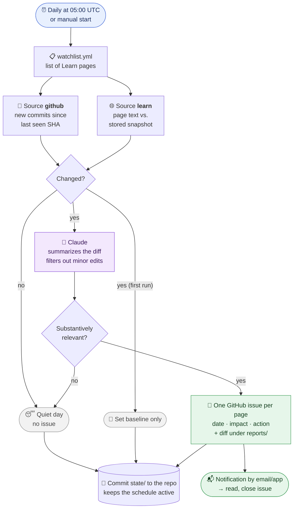

# ms-deprecation-watch

Checks the Microsoft Learn pages about deprecations (Power Platform, Dynamics 365 CE,
Copilot Studio) every day and opens a **GitHub issue** when their content has changed.
GitHub then notifies you by email or in the app. On quiet days, nothing arrives.



## How it works

1. `watchlist.yml` lists the pages. There are two source types:
   - `github`: new commits to the Markdown file in the public `MicrosoftDocs/*` repo
     (exact diff + commit links). The last seen commit SHA serves as the bookmark, so
     no changes are lost even if runs fail.
   - `learn`: for pages without a public repo (e.g. Copilot Studio). The text of the
     rendered page is stored as a snapshot in `state/snapshots/` and compared.
2. Claude (`claude-opus-5`) summarizes each diff in the configured language and filters out minor edits
   (typos, `ms.date`, links, formatting).
3. A **separate issue** is created for each page with relevant changes, labeled
   `deprecation-watch` plus the product area (e.g. `D365 Sales`). The title carries the
   key message, and the body is email-friendly: date, impact and action for each deprecation.
   The workflow stores the full diff under `reports/<date>/<id>.diff`, and the issue
   links to it. Close the issue after review.
4. The workflow commits the state (`state/`) back to the repo. The daily commit keeps the
   repo active; otherwise GitHub disables schedules after 60 days of inactivity.

On the **first run**, only the baseline is set and no issue is created.

## Setup

1. Create the secret `ANTHROPIC_API_KEY` (Settings → Secrets and variables → Actions).
   Without a key everything still runs, but without summaries or relevance filtering.
2. Optional: set the repo variable `CLAUDE_MODEL` to use a different model
   (e.g. `claude-sonnet-5`, which is cheaper).
3. Optional: set the repo variable `REPORT_LANGUAGE` to `de` to get the issues in German.
   Default is `en` (English).
4. Notifications: set the repo to **Watch → All Activity** (or Custom → Issues)
   so that new issues arrive by email.
5. Start it once manually: Actions → *Deprecation Watch* → *Run workflow*
   (this sets the baseline).

## Watched pages

All watched pages are defined in [`watchlist.yml`](watchlist.yml). Currently:

| Product area | Page | Source |
|---|---|---|
| Power Platform | [Important changes (deprecations) coming in Power Platform](https://learn.microsoft.com/en-us/power-platform/important-changes-coming) | `github` |
| Canvas Apps | [Important upcoming changes (deprecations) in canvas apps](https://learn.microsoft.com/en-us/power-apps/maker/canvas-apps/important-changes-deprecations) | `github` |
| Power Pages | [Important upcoming changes and deprecations in Power Pages](https://learn.microsoft.com/en-us/power-pages/important-changes-deprecations) | `github` |
| D365 Customer Service | [Deprecations in Dynamics 365 Customer Service](https://learn.microsoft.com/en-us/dynamics365/customer-service/implement/deprecations-customer-service) | `github` |
| D365 Sales | [Removed or deprecated features in Dynamics 365 Sales](https://learn.microsoft.com/en-us/dynamics365/sales/deprecations-sales) | `github` |
| D365 Field Service | [Feature deprecations – Dynamics 365 Field Service](https://learn.microsoft.com/en-us/dynamics365/field-service/deprecations-field-service) | `github` |
| Copilot Studio | [What's new in Copilot Studio](https://learn.microsoft.com/en-us/microsoft-copilot-studio/whats-new) | `learn` |
| Copilot Studio | [Select a primary AI model](https://learn.microsoft.com/en-us/microsoft-copilot-studio/authoring-select-agent-model) | `learn` |
| Copilot Studio | [Continue using a retired AI model](https://learn.microsoft.com/en-us/microsoft-copilot-studio/authoring-retired-model) | `learn` |

## Changing the watchlist

To add, change or remove a page, edit `watchlist.yml` and commit the change to `main`.
The next scheduled run picks it up; start the workflow manually if you don't want to wait.

### Adding a page

1. **Find the source.** Open the page on Microsoft Learn and click the edit pencil
   (*Edit*, top right). It leads to the Markdown file on GitHub, e.g.
   `https://github.com/MicrosoftDocs/power-platform/blob/main/power-platform/important-changes-coming.md`.
   Read it as `github.com/<repo>/blob/<branch>/<path>`.
   - If the link points to a private `…-pr` repo, drop the `-pr` suffix and use the branch
     `main` instead of `live`.
   - If there is no edit pencil or no public repo (as for Copilot Studio), use `source: learn`.
2. **Add an entry** under `pages:` in `watchlist.yml`:

   ```yaml
   # Page with a public docs repo: exact diffs and commit links
   - id: power-automate                 # unique, lowercase, used for state and file names
     short: Power Automate              # shown in the issue title and used as label
     name: Deprecated features in Power Automate   # page title, passed to Claude
     url: https://learn.microsoft.com/en-us/power-automate/...
     source: github
     repo: MicrosoftDocs/power-automate-docs
     branch: main                       # optional, default: main
     path: articles/....md

   # Page without a public repo: compare the rendered page text
   - id: copilot-studio-whats-new
     short: Copilot Studio
     name: What's new in Copilot Studio
     url: https://learn.microsoft.com/en-us/microsoft-copilot-studio/whats-new
     source: learn
   ```

3. **Check it locally** (optional): `DRY_RUN=1 python watch.py` must list the new page
   without an error (see [Testing locally](#testing-locally)).
4. **Commit and push.** On its first run, the new page only gets a baseline. Issues
   follow from the next change onwards.

Prefer `github` over `learn` where possible: it yields exact diffs, commit links, and
catches changes even if a run fails. `learn` only sees the difference between two runs and
can report layout changes of the Learn site as content changes.

### Changing or removing a page

- **Remove** the entry from `watchlist.yml`. Its old state in `state/` stays but is no
  longer used.
- **Changing `short` or `name`** only affects new issues.
- **Changing `id`** makes the page count as new: the next run sets a fresh baseline and
  reports nothing for that run.
- **When a page moves** (the run then creates an error issue such as *No commits found …
  was the file moved?*), update `url` and `path`. For a `github` page, also change the `id`:
  otherwise the stored commit is not found in the new file's history, and the next run
  reports up to 30 old commits as one large change. For a `learn` page, keep the `id` so
  the new page is compared with the last snapshot.

## Testing locally

```bash
python -m venv .venv && .venv/Scripts/pip install -r requirements.txt
DRY_RUN=1 .venv/Scripts/python watch.py
```

With `DRY_RUN=1`, no issue is created and no state is saved.
`TEST_REWIND=3` checks the GitHub sources as if the last check was 3 commits ago
(forces a dry run). In Actions, the same is available as the `test_rewind` input when starting manually.
